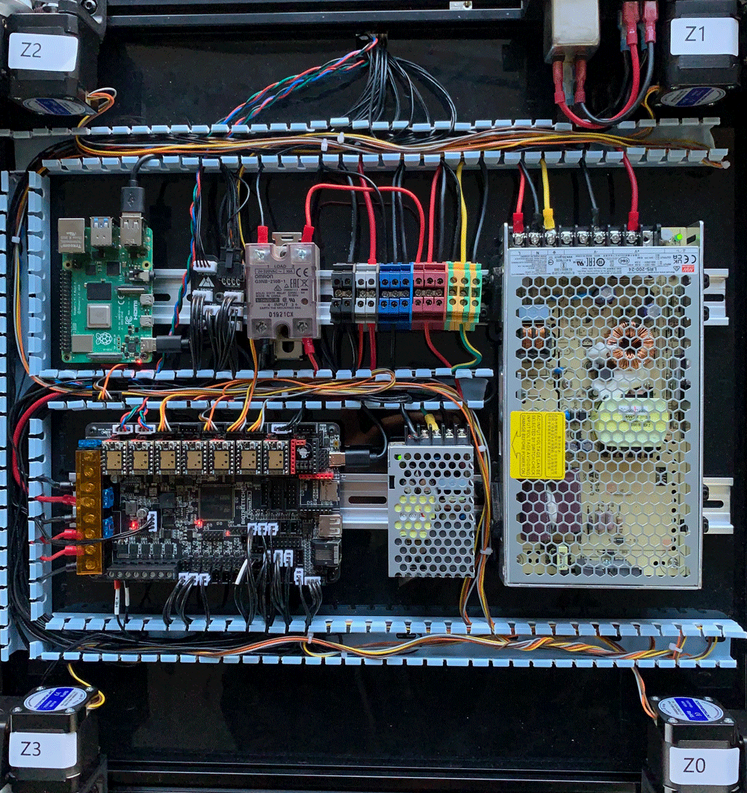

# Wiring Guide

Harness list :

U1: AC wiring: 5 wires. 2 for Power Inlet to Switch, 2 for Switch to UK2.5 terminals, 1 for Power Inlet to UK2.5 terminal(Ground).

U2: AC wiring: 3 wires, from UK2.5 terminals to LRS-200-24(Nature, Line, Ground)

U3: AC wiring: 3 wires, from UK2.5 terminals to RS-25-5(Nature, Line, Ground)

U4: AC wiring: 1 wire, from UK2.5 terminal to SSR.

U5: DC wiring: 2 wires, from LRS-200-24 to UK2.5 terminals.

U6: DC wiring: 4 wires, from Octopus(Power In / Bed In) to UK2.5 terminals. Use the 14awg wires for Power In.

U7: DC wiring: 2 wires, from Octopus(Bed Out) to SSR DC IN.

U8: 8 wires. From breakout pcb to Octopus(X Endstop, Y endstop, Fan0, Fan1, Probe0, Probe1, Thermistor, LED)

S1: 5 wires. 8P toolhead PCB cable, 2P toolhead heater, 4P PT100, 4P Extruder stepper, 4P endstop.

S2: 4 wires. Z endstop cable, bed heater thermistor, buildplate thermistor, bed heater power/ground wires.

USB type-c power cable to RS-25-5.

MicroUSB power cable to RS-25-5.

## AC Wiring

Before installed LRS-200-24, make sure 110V/230V switch is right.

### Checking:

1.Use a multimeter to check whether there is a shorted between Live/Neutral/Earch.

2.Plug in power cord and turn on the swith, LRS-200-24 and RS-25-5 should turn on and their LEDs should light up.

## Basic DC Wring

Note: Use the thickest wire(14AWG) from Octopus Power In to UK-2.5 terminal , and make sure wire to the same terminal which LRS-200-24 wired to.

### Checking:

1.Use a multimeter to check whether there is a shorted between 24V+ and GND.

2.Plug in power cord and turn on the swith, Octopus should turn on and its LEDs should light up.

## Octopus Wiring

## Toolhead PCB & Breakout PCB

There’s some differce from our Toolhead PCB and voron offical’s, to avoid the interference of the motor to PT100, we use 8p+2p toolhead pcb cable and 2 * 4P for extractor stepper and PT100.

### Breakout PCB

### Toolboard PCB

Jumpers: For default config, set `PB_VCC` and `FAN_VCC` to `24V`, set `TH` to `CT_TH`

There is a thermistor on the PCB for chamber temperature, `Ext_TH` port allows you wire another thermistor, but they share the same port.

There would be a free probe port, you can use it for ERCF or anything.

| Port       | Wire To            | Note                        |
| ---------- | ------------------ | --------------------------- |
| PROBE1     | TL-Q5MC2           | If you ordered TL-Q5MC2     |
| LED        | Stealthburner LED  |                             |
| FAN1       | Part Cooling Fan   |                             |
| Ext_TH     | Null               |                             |
| PROBE0     | Klicky Probe       | If you ordered Klicky Probe |
| FAN0       | Hotend Cooling Fan |                             |
| Heater Out | Hotend Heater      |                             |
|            |                    |                             |

## Overview

You can cut off the PVC trunking tooth if too crowded, especlly the bottom of breakout PCB.

cover the PVC trunking, done !

## Best Practices

To ensure that the exposed length of the wire is appropriate and looks well, please follow the following best practices.

In short, plug in all connectors located at one end of the build chamber, then start wiring.

The cables of steppers/PT100 has been twisted in advance to prevent interference. Do not disassemble them and keep them intact in the drag chain.

1. Install everythingnbut do not install drag chains.
2. Install in the following order
3. Make a 10×10 drag chain to a suitable length for the x-axis, depending on the size of the machine, you may need to remove one or more sections.
4. One side of the drag chain can be opened. Open them all.
5. Plug in all connectors on the toolhead side and install the drag chain on the toolhead side. (8P main cable, 4P extruder stepper, 4P PT100)
6. If it looks strange, remove the end of the drag chain and flip it over for reinstallation.
7. Put all the wires into X axis drag chain, close the drag chain and install it on the other side. There is a protruding part at the end of the drag chain, recommended to fix wires there with a zip tie.
8. Plug in XY endstop connector (4P JST connector), then go through XY trunking with the above wires and fix it with zip ties.
9. The same as step 3-7, make another 10×10 drag chain, put all wires into it then install another end.
10. Plug in A/B steppers connectors, use 10×15 drag chain and repeat 3-7 steps on Z axis.
11. Done! Now turn the machine over and start playing magic in the electrical compartment.